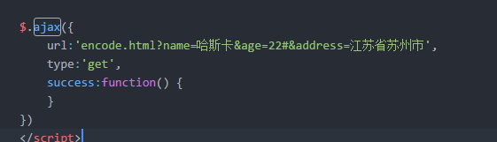
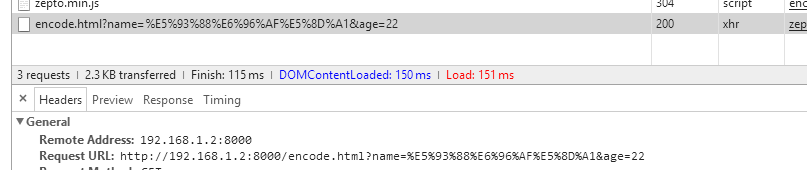
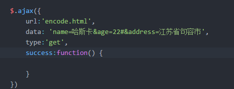
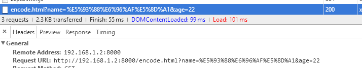
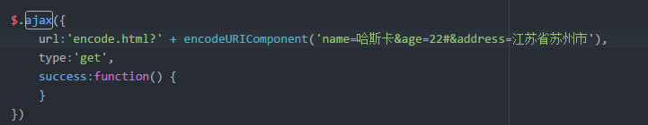
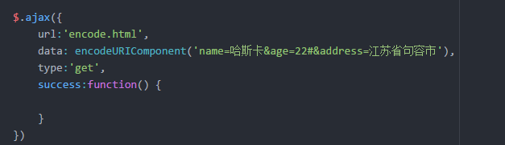
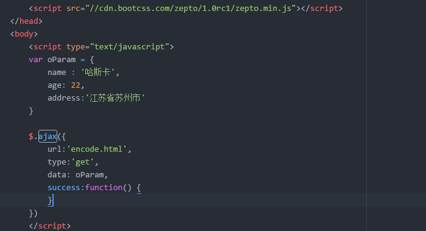
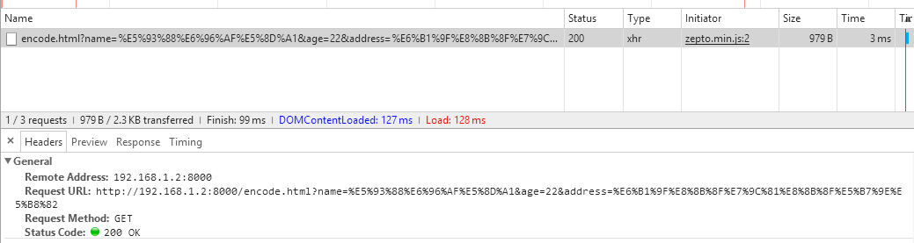
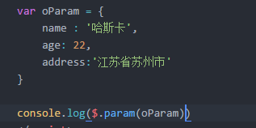

前端页面向后台提交数据，可能会忽略编码的问题,如果是get方法提交url中有特殊符号`#`会出现问题。

- 如下图，如果打开一个url，`#`后面的会被浏览器当做是hash，这个是不会通过http请求发送到服务器的。

- 用ajax提交数据，下图是用zepto 的`$.ajax`方法（jquery大体类似）

从图中可以看到，`#`及后面的数据没有发送出去

- 以下是另外一种写法，都是get方法原理都是一致的，都是通过url参数发送数据，所以`#`及后面的也没有发送出去

- 解决方法对url中的参数用`encodeURIComponent`进行编码处理

注意上图中拼接url时是对`?`号后面的参数进行编码，不是对整个url编码。否则`?`也会被编码，那url就是错的，会找不到页面。

- 或者采用下图这种方式，`$.ajax` 方法里会自动把data参数拼接到url后面

- 如果 `$.ajax` 的 `data`参数直接传的是一个对象，方法内部会调用 `$.param`方法进行序列化参数，此方法内部会进行编码

- `$.param`方法进行序列化的结果

